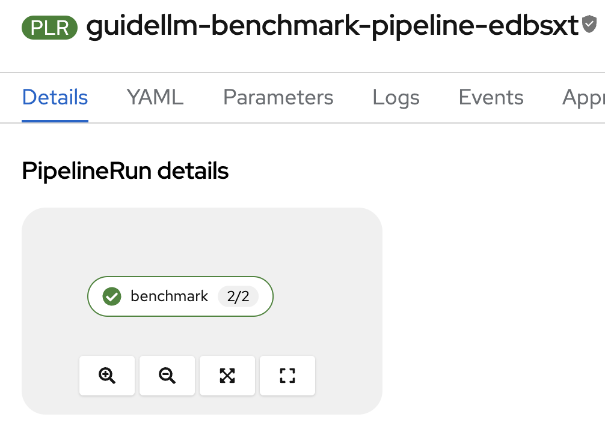
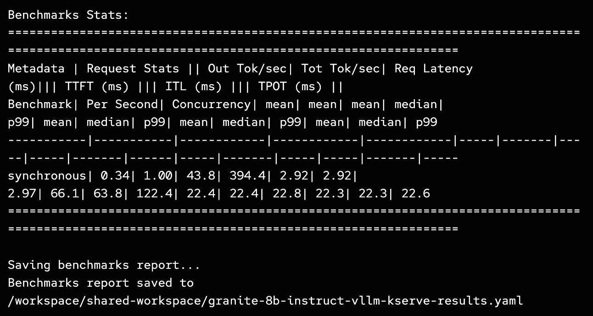
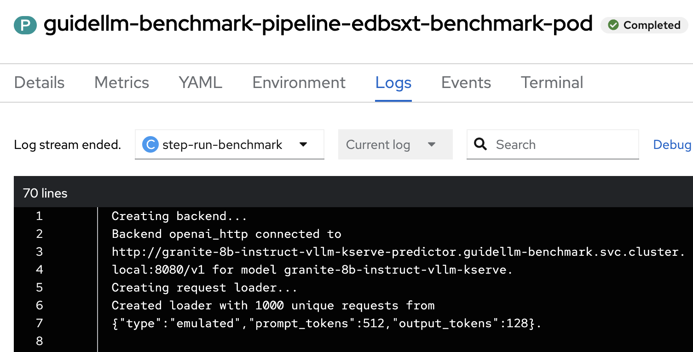
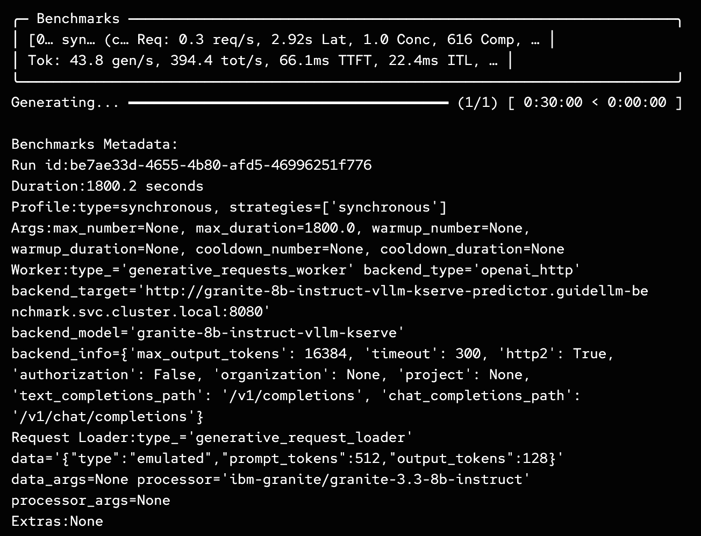

# GuideLLM Benchmark Pipeline

A configurable pipeline for running [GuideLLM](https://github.com/neuralmagic/guidellm) benchmarks against LLM endpoints.





## GuideLLM Overview

GuideLLM evaluates and optimizes LLM deployments by simulating real-world inference workloads to assess performance, resource requirements, and cost implications across different hardware configurations.

## Key Features

- **Performance & Scalability Testing**: Analyze LLM inference under various load scenarios to meet SLOs
- **Resource & Cost Optimization**: Determine optimal hardware configurations and deployment strategies
- **Flexible Deployment**: Support for Kubernetes Jobs and Tekton Pipelines with configurable parameters
- **Automated Results**: Timestamped output directories with comprehensive benchmark results

## Usage

### Running as Kubernetes Job

```bash
# Apply the PVC
kubectl apply -f pvc.yaml

# Apply the ConfigMap (optional)
kubectl apply -f config.yaml

# Run the job with default settings
kubectl apply -f guidellm-job.yaml

# Or customize environment variables
kubectl set env job/run-guidellm TARGET=http://my-endpoint:8000/v1
kubectl set env job/run-guidellm MODEL_NAME=my-model
```

### Running as Tekton Pipeline

```bash
# Apply the task and pipeline
kubectl apply -f tekton-task.yaml
kubectl apply -f tekton-pipeline.yaml

# Run with parameters
tkn pipeline start guidellm-benchmark-pipeline \
  --param target=http://llama32-3b.llama-serve.svc.cluster.local:8000/v1 \
  --param model-name=llama32-3b \
  --param processor=RedHatAI/Llama-3.2-3B-Instruct-quantized.w8a8 \
  --param data-config='{"type":"emulated","prompt_tokens":512,"output_tokens":128}' \
  --workspace name=shared-workspace,claimName=guidellm-output-pvc
```

Once the Tekton pipeline starts, the GuideLLM benchmark CLI will be triggered with the input parameters:



The GuideLLM benchmark will begin running and start simulating real-world inference workloads against the target endpoint:



## Configuration Options

### Environment Variables
- `TARGET`: Model endpoint URL
- `MODEL_NAME`: Model identifier
- `PROCESSOR`: Processor/model path
- `DATA_CONFIG`: JSON data configuration
- `OUTPUT_FILENAME`: Output file name
- `RATE_TYPE`: Rate type (synchronous/poisson)
- `MAX_SECONDS`: Maximum benchmark duration

## Results

The benchmark generates comprehensive performance metrics and visualizations:


The results provide detailed insights into throughput, latency, resource utilization, and other key performance indicators to help optimize your LLM deployment strategy.

## Output Structure

Results are organized in timestamped directories:
```
/output/
├── model-name_YYYYMMDD_HHMMSS/
│   ├── benchmark-results.yaml
│   └── benchmark_info.txt
└── model-name_YYYYMMDD_HHMMSS.tar.gz
```