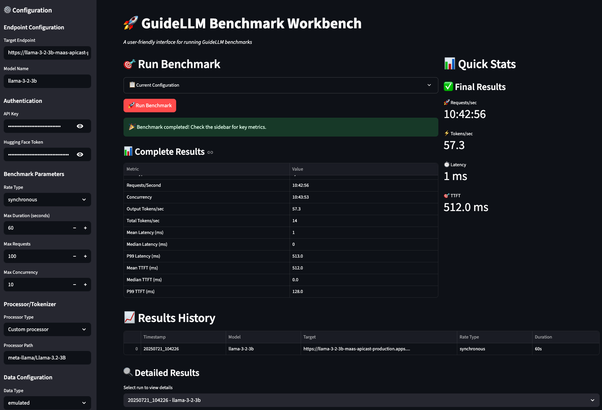
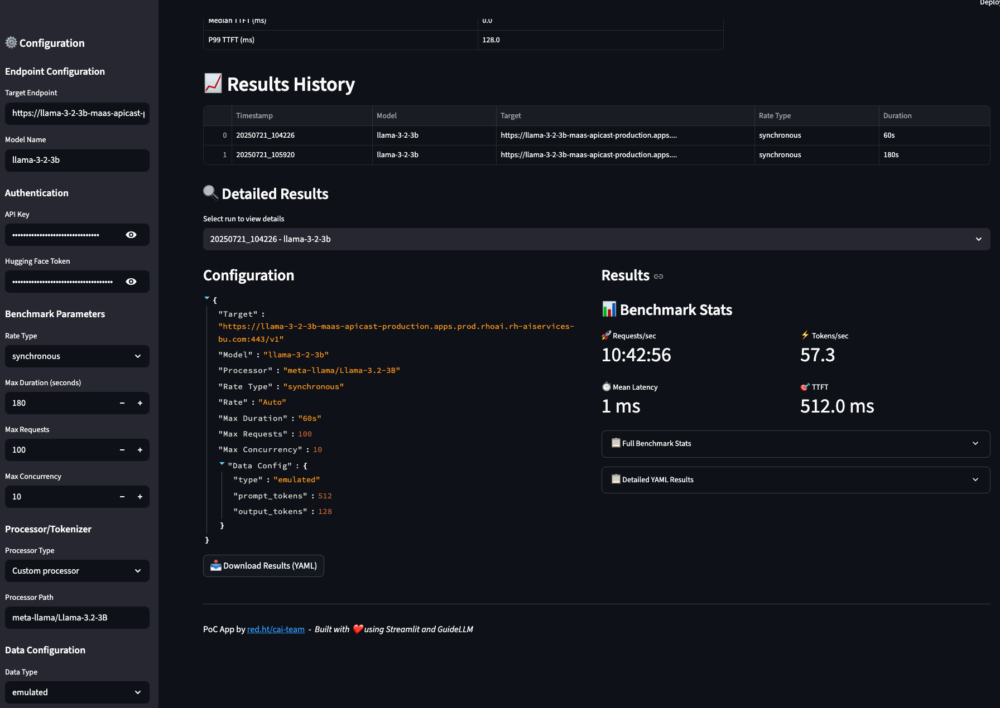

# GuideLLM Benchmark Pipeline & Workbench

A configurable pipeline for running [GuideLLM](https://github.com/neuralmagic/guidellm) benchmarks against LLM endpoints.


## Table of Contents

- [GuideLLM Overview](#guidellm-overview)
- [Key Features](#key-features)
- [Usage](#usage)
  - [Running as Kubernetes Job](#running-as-kubernetes-job)
  - [Running as Tekton Pipeline](#running-as-tekton-pipeline)
- [Configuration Options](#configuration-options)
- [Results](#results)
- [Output Structure](#output-structure)
- [GuideLLM Workbench](#guidellm-workbench)
  - [Features](#features)
  - [Running the Workbench](#running-the-workbench)

## GuideLLM Overview

GuideLLM evaluates and optimizes LLM deployments by simulating real-world inference workloads to assess performance, resource requirements, and cost implications across different hardware configurations.

## Key Features

- **Performance & Scalability Testing**: Analyze LLM inference under various load scenarios to meet SLOs
- **Resource & Cost Optimization**: Determine optimal hardware configurations and deployment strategies
- **Flexible Deployment**: Support for Kubernetes Jobs and Tekton Pipelines with configurable parameters
- **Automated Results**: Timestamped output directories with comprehensive benchmark results

## Usage

### Running as Kubernetes Job

```bash
# Apply the PVC
kubectl apply -f pvc.yaml

# Apply the ConfigMap (optional)
kubectl apply -f config.yaml

# Run the job with default settings
kubectl apply -f guidellm-job.yaml

# Or customize environment variables
kubectl set env job/run-guidellm TARGET=http://my-endpoint:8000/v1
kubectl set env job/run-guidellm MODEL_NAME=my-model
```

### Running as Tekton Pipeline

```bash
# Apply the task and pipeline
kubectl apply -f tekton-task.yaml
kubectl apply -f tekton-pipeline.yaml

# Run with parameters
tkn pipeline start guidellm-benchmark-pipeline \
  --param target=http://llama32-3b.llama-serve.svc.cluster.local:8000/v1 \
  --param model-name=llama32-3b \
  --param processor=RedHatAI/Llama-3.2-3B-Instruct-quantized.w8a8 \
  --param data-config='{"type":"emulated","prompt_tokens":512,"output_tokens":128}' \
  --workspace name=shared-workspace,claimName=guidellm-output-pvc
```

Once the Tekton pipeline starts, the GuideLLM benchmark CLI will be triggered with the input parameters:


The GuideLLM benchmark will begin running and start simulating real-world inference workloads against the target endpoint:


## Configuration Options

### Environment Variables
- `TARGET`: Model endpoint URL
- `MODEL_NAME`: Model identifier
- `PROCESSOR`: Processor/model path
- `DATA_CONFIG`: JSON data configuration
- `OUTPUT_FILENAME`: Output file name
- `RATE_TYPE`: Rate type (synchronous/poisson)
- `MAX_SECONDS`: Maximum benchmark duration

## Results

The benchmark generates comprehensive performance metrics and visualizations:


The results provide detailed insights into throughput, latency, resource utilization, and other key performance indicators to help optimize your LLM deployment strategy.

## Output Structure

Results are organized in timestamped directories:
```
/output/
├── model-name_YYYYMMDD_HHMMSS/
│   ├── benchmark-results.yaml
│   └── benchmark_info.txt
└── model-name_YYYYMMDD_HHMMSS.tar.gz
```

## GuideLLM Workbench

The GuideLLM Workbench provides a user-friendly Streamlit web interface for running benchmarks interactively with real-time monitoring and result visualization.



### Features

- **Interactive Configuration**: Easy-to-use forms for endpoint, authentication, and benchmark parameters
- **Real-time Monitoring**: Live metrics parsing during benchmark execution
- **Quick Stats**: Sidebar with key performance indicators (requests/sec, tokens/sec, latency, TTFT)
- **Results History**: Session-based storage with detailed result viewing
- **Download Results**: Export benchmark results as YAML files
- **Comprehensive Results View**: Detailed breakdown of all performance metrics



### Running the Workbench

#### Local Development
```bash
cd utils/guidellm-wb
pip install -r requirements.txt
streamlit run app.py
```

#### Container Deployment
```bash
# Build the container
podman build -f utils/guidellm-wb/Containerfile -t guidellm-workbench .

# Run the container
podman run -p 8501:8501 guidellm-workbench
```

The workbench will be available at `http://localhost:8501` and provides an intuitive interface for configuring and running GuideLLM benchmarks with immediate feedback and comprehensive result analysis.

