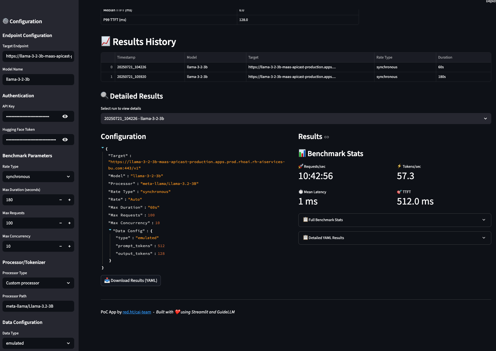

# GuideLLM Workbench

A user-friendly Streamlit interface for running GuideLLM benchmarks with real-time output and result visualization.



## Features

- 🎯 **Easy Configuration**: Simple form-based input for all GuideLLM parameters
- 🚀 **Real-time Execution**: Live output display during benchmark runs
- 📊 **Result Visualization**: Interactive charts and metrics display
- 💾 **Result Storage**: Automatic saving and history of benchmark results
- 🔐 **Secure Authentication**: Support for API keys and tokens
- 📈 **Multiple Rate Types**: Support for all GuideLLM rate types (synchronous, poisson, sweep, etc.)

## Quick Start

1. **Install Dependencies**
   ```bash
   pip install -r requirements.txt
   ```

2. **Ensure GuideLLM is Available**
   ```bash
   # Install guidellm if not already available
   pip install guidellm
   ```

3. **Run the Application**
   ```bash
   streamlit run app.py
   ```

4. **Access the UI**
   Open your browser to `http://localhost:8501`

## Usage

### Basic Workflow

1. **Configure Endpoint**: Enter your target LLM endpoint URL
2. **Set Model**: Specify the model name/identifier
3. **Authentication**: Add API keys or tokens if required
4. **Benchmark Parameters**: Configure rate type, duration, concurrency, etc.
5. **Data Configuration**: Set prompt/output token counts or custom data
6. **Run Benchmark**: Click "Run Benchmark" and monitor real-time output
7. **View Results**: Explore results in the history section with downloadable YAML files


### Supported Parameters

#### Endpoint Configuration
- **Target Endpoint**: LLM server URL (e.g., `http://localhost:8000/v1`)
- **Model Name**: Model identifier

#### Authentication
- **API Key**: OpenAI-compatible API key
- **Hugging Face Token**: For accessing gated models

#### Benchmark Parameters
- **Rate Type**: `synchronous`, `throughput`, `concurrent`, `constant`, `poisson`, `sweep`
- **Max Duration**: Maximum benchmark runtime (seconds)
- **Max Requests**: Maximum number of requests
- **Max Concurrency**: Maximum concurrent requests

#### Data Configuration
- **Emulated**: Specify prompt and output token counts
- **Custom**: Provide custom JSON configuration

## Example Configurations

### Basic Performance Test
```
Target: http://localhost:8000/v1
Model: llama-3.2-3b
Rate Type: synchronous
Max Duration: 300 seconds
Prompt Tokens: 512
Output Tokens: 128
```

### Load Testing
```
Target: http://your-endpoint:8000/v1
Model: your-model
Rate Type: sweep
Max Duration: 600 seconds
Max Concurrency: 50
```

## Output Files

Results are automatically saved in timestamped directories:
```
./results/
├── model-name_YYYYMMDD_HHMMSS/
│   └── benchmark-results.yaml
```